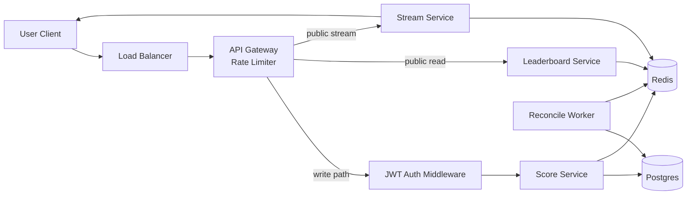
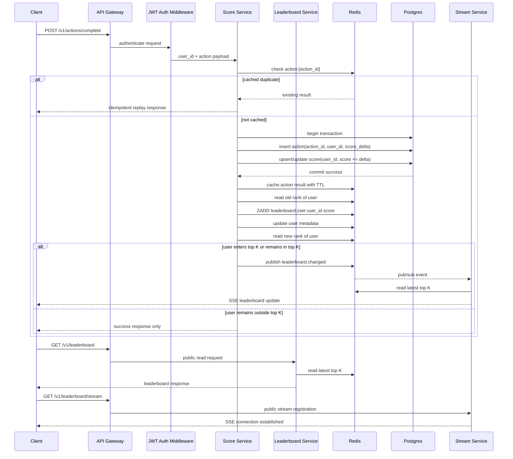

# Problem 6 - API Service Module Specification

## 1. Scope

This document specifies the backend API service module for a live leaderboard system.

### 1.1 Purpose

The module is responsible for:

- accepting score update requests from authenticated users
- preventing duplicate score updates for the same action through idempotency
- persisting action history and aggregated user score
- serving the current top `K` leaderboard efficiently
- pushing live leaderboard updates to connected clients through SSE
- tolerating burst updates with Redis as the hot read/write cache and Postgres as the source of truth

### 1.2 Scope boundaries

| In scope | Out of scope |
| --- | --- |
| Duplicate prevention through `action_id` idempotency | Business validation of whether an action is legitimate |
| Burst update handling | Anti-cheat or proof validation logic |
| Leaderboard read optimization | User registration and credential lifecycle |
| Live update propagation through SSE | Frontend rendering logic |
| Redis-backed hot cache and pub/sub | Non-leaderboard business modules |

### 1.3 Assumptions

- each score-increasing action carries a globally unique `action_id`
- `action_id` is enforced as unique in the database
- score delta is trusted from the caller boundary for this exercise
- the leaderboard shown to end users is top `K`, where `K=10` by default

## 2. Architecture Design

### 2.1 Simple execution chart



### 2.2 Detailed architecture visualization

The following diagram is the detailed architecture view of the same design. It expands the simplified chart above and shows the concrete services, cache structures, reconciliation path, and event propagation path used in this specification.


The source of this diagram is maintained in `problem-6/highlevel.excalidraw.json`.

### 2.3 Components and rationale

| Component | Role | Why |
| --- | --- | --- |
| `API Gateway` | Terminates inbound traffic, applies coarse rate limiting, routes requests. | Protects the backend during bursts and centralizes entry control. |
| `JWT Auth Middleware` | Validates JWT and resolves `user_id` for the write path. | Keeps score updates authenticated while leaving leaderboard read and SSE stream endpoints public. |
| `Score Service` | Owns the write path for `push action -> update score`. | Keeps idempotency, transactional writes, Redis update, and publish logic in one boundary. |
| `Leaderboard Service` | Owns the read path for top `K` queries. | Isolates cache-first read logic and fallback-to-Postgres behavior. |
| `Stream Service` | Owns SSE stream registration and event fanout. | Separates live streaming concerns from request-response APIs and keeps client connections local to each instance. |
| `Reconcile Worker` | Periodically rebuilds Redis leaderboard state from Postgres and republishes when top `K` changes. | Adds a self-healing path for missed events, Redis eviction, Redis restart, or partial cache update failures. |
| `Postgres` | Source of truth for actions and aggregated user score. | Provides durability, transactional correctness, and uniqueness guarantees on `action_id`. |
| `Redis` | Stores hot idempotency data, leaderboard cache, and pub/sub events. | Absorbs burst traffic, enables low-latency reads, and broadcasts write events across all service instances in a horizontally scaled deployment. |

### 2.4 Why the design evolved to the current version

The simplest design is "write score directly to database, query top 10 directly from database, and poll from clients". That design is correct at low scale, but it degrades quickly under burst writes and frequent leaderboard refreshes.

The current version introduces:

- `Score Service` as a dedicated write boundary so duplicate handling and transactional updates stay in one place
- `Leaderboard Service` as a dedicated read boundary so top `K` logic and cache-miss recovery stay isolated
- Redis leaderboard cache so reads do not repeatedly sort or aggregate from Postgres
- Redis pub/sub plus `Stream Service` so a write event produced on one instance can notify every other instance and reach all connected SSE clients without polling
- `Cached: Action` as an optimization layer to reduce repeated duplicate processing before hitting Postgres
- a background reconciliation worker path from Postgres to Redis so cache and stream state can self-heal after transient failures or cache loss

### 2.5 Detailed component behavior

#### Score write path

- request enters through gateway and JWT middleware
- Score Service checks Redis action cache for fast duplicate detection
- Score Service executes one database transaction:
  - insert into `actions`
  - update `scores`
- database uniqueness on `action_id` is the final correctness guard
- after commit, Score Service updates Redis leaderboard structures
- Score Service determines whether top `K` changed by comparing the updated user's rank before and after the Redis update
- if changed, Score Service publishes a leaderboard update event to Redis pub/sub

#### Leaderboard read path

- leaderboard query is a public endpoint and does not require JWT authentication
- Leaderboard Service attempts Redis read first
- if cache hit, response is returned immediately
- if cache miss, service queries Postgres `scores`
- service rebuilds Redis top `K` cache and returns the result

#### Live stream path

- client registers an SSE stream through Stream Service without JWT authentication
- each Stream Service instance subscribes to Redis pub/sub leaderboard events
- when one instance publishes a top `K` change, Redis pub/sub broadcasts that event to all subscribed service instances
- each receiving instance pushes a new SSE event to the clients currently connected to that instance
- if an SSE client reconnects, it should re-fetch the latest leaderboard state from Leaderboard Service

#### Reconciliation path

- a worker periodically rebuilds Redis leaderboard state from Postgres
- the worker compares the previous top `K` in Redis with the rebuilt top `K`
- the worker publishes an update event only if the rebuilt top `K` differs from the previous top `K`
- this protects the system from missed pub/sub messages, Redis eviction, Redis restart, or partial post-commit cache update failures
- `leaderboard:zset` and `leaderboard:user_meta` are long-lived Redis structures without TTL
- freshness of leaderboard state is maintained by synchronous write-path updates plus periodic reconciliation from Postgres

## 3. Entity Design

### 3.1 User

Represents identity and display information only. User score is intentionally not stored in this entity.

| Field | Type | Notes |
| --- | --- | --- |
| `user_id` | string / uuid | primary identifier |
| `display_name` | string | used for leaderboard display |
| `avatar_url` | string nullable | optional profile field |
| `created_at` | timestamp | audit field |

### 3.2 Action

Represents one score-increasing action submitted by a user.

| Field | Type | Notes |
| --- | --- | --- |
| `action_id` | string / uuid | unique idempotency key |
| `user_id` | string / uuid | owner of the action |
| `score_delta` | integer | positive score increment |
| `result` | json / text | optional response payload for idempotent replay |
| `created_at` | timestamp | action creation time |

Constraints:

- primary key or unique index on `action_id`
- index on `user_id, created_at`

### 3.3 Score

Represents the aggregated score per user. This is the read-friendly persistent state used for leaderboard queries.

| Field | Type | Notes |
| --- | --- | --- |
| `user_id` | string / uuid | primary key |
| `score` | bigint | accumulated score |
| `last_updated` | timestamp | last successful update time |

Constraints:

- primary key on `user_id`
- descending index on `score` may be added if Postgres top `K` fallback query needs optimization

### 3.4 Redis data model

#### Cached Action

Key example:

- `action:{action_id}`

Value:

- action status or normalized idempotent result

Purpose:

- short-circuit duplicate requests before database access
- optionally store replayable action response data with TTL

#### Cached Leaderboard

Keys:

- `leaderboard:zset`
- `leaderboard:user_meta`

Structure:

- `leaderboard:zset`: sorted set with `member=user_id`, `score=user_score`
- `leaderboard:user_meta`: hash or per-user hash for display info
- both structures are long-lived and are not expected to expire through TTL

Change detection:

- on the hot write path, the service can read the updated user's rank before and after `ZADD`
- if the user remains outside top `K`, no live update is published
- if the user enters top `K` or is already inside top `K`, the service publishes a new top `K` event
- on the worker reconciliation path, the worker compares the old top `K` from Redis against the rebuilt top `K`

## 4. Critical Flow Of The Application

### 4.1 Narrative

The most critical flow is:

`user pushes action -> backend updates score safely -> leaderboard changes -> clients receive SSE update`

This flow must remain correct under duplicate requests and under burst traffic.

### 4.2 End-to-end execution flow

1. Client sends `POST /v1/actions/complete` with JWT and action payload.
   Critical: identity is derived only from JWT, never from request body.
2. API Gateway applies coarse rate limiting and forwards the request through JWT middleware.
   Critical: invalid or missing JWT must be rejected before touching Redis or Postgres.
3. Score Service checks Redis cached action state for fast duplicate detection.
   Critical: this is only a performance optimization, not the final correctness guard.
4. Score Service executes one Postgres transaction:
   - insert `actions`
   - update `scores`
   Critical: `UNIQUE(action_id)` is the final duplicate-prevention mechanism.
5. After commit, Score Service updates Redis leaderboard structures.
   Critical: Redis update and publish are post-commit side effects.
6. Score Service compares the updated user's rank before and after the Redis update.
   Critical: if the user remains outside top `K`, no SSE event is required.
7. If top `K` is affected, Score Service publishes `leaderboard.changed` through Redis pub/sub.
8. Redis pub/sub broadcasts the event to all service instances subscribed to the channel.
9. Each Stream Service instance re-reads the latest top `K` from Redis.
10. Each Stream Service instance pushes an SSE update to the clients currently connected to that instance.
11. Independently, a reconciliation worker periodically rebuilds Redis state from Postgres and compares old top `K` with rebuilt top `K`.
   Critical: this is the recovery path for missed events, Redis eviction, or partial cache update failures.

The leaderboard read endpoint and SSE stream endpoint are public in this design. Only the score update endpoint requires JWT authentication.

### 4.3 Sequence diagram



### 4.4 Critical correctness points

| Point | What | Why |
| --- | --- | --- |
| Duplicate safety | `UNIQUE(action_id)` in Postgres is the final guard. | Prevents double increment under retries or concurrent duplicate requests. |
| Transaction boundary | Action insert and score update must happen in one database transaction. | Prevents partial persistence of write state. |
| Post-commit cache effects | Redis update and pub/sub publish happen only after commit succeeds. | Prevents cache or stream state from reflecting rolled-back writes. |
| Recovery path | A reconciliation worker rebuilds Redis from Postgres when needed. | Repairs cache drift after missed publish events or Redis failures. |
| SSE semantics | SSE is only for propagation, not for state authority. | Clients must re-fetch leaderboard state after reconnect or stream loss. |

## 5. API Contracts

### 5.1 Complete action and increase score

`POST /v1/actions/complete`

Purpose:

- submit one score-increasing action
- enforce idempotency by `action_id`

Request headers:

- `Authorization: Bearer <jwt>`
- `Idempotency-Key: <action_id>` optional if duplicated in body, but one canonical source should be chosen

Request body:

```json
{
  "action_id": "8f5d1d73-4d09-4cf6-8d1c-9c3f3f7f8f5a",
  "score_delta": 10
}
```

Success response:

```json
{
  "action_id": "8f5d1d73-4d09-4cf6-8d1c-9c3f3f7f8f5a",
  "user_id": "user-123",
  "applied": true,
  "current_score": 120,
  "top_k_changed": true
}
```

Duplicate idempotent replay response:

```json
{
  "action_id": "8f5d1d73-4d09-4cf6-8d1c-9c3f3f7f8f5a",
  "user_id": "user-123",
  "applied": false,
  "duplicate": true,
  "current_score": 120,
  "top_k_changed": false
}
```

Behavior note:

- if the request reuses an existing `action_id`, the service returns the previously stored response for that action instead of returning `409 Conflict`

Error cases:

- `401 Unauthorized`: invalid or missing JWT
- `429 Too Many Requests`: gateway rate limiting
- `500 Internal Server Error`: unexpected processing failure

### 5.2 Get leaderboard top K

`GET /v1/leaderboard`

Purpose:

- fetch the latest server-defined top `K` leaderboard state
- this is a public endpoint and does not require authentication

Response:

```json
{
  "generated_at": "2026-04-10T15:00:00Z",
  "items": [
    {
      "rank": 1,
      "user_id": "user-123",
      "display_name": "Alice",
      "score": 120
    }
  ]
}
```

Notes:

- top `K` is determined by backend configuration and is not client-configurable
- service should prefer Redis hot read
- service may rebuild cache on miss from Postgres `scores`

### 5.3 Register leaderboard SSE stream

`GET /v1/leaderboard/stream`

Purpose:

- open a server-sent events stream for live leaderboard changes

Headers:

- `Accept: text/event-stream`

SSE event example:

```text
event: leaderboard.updated
data: {"items":[{"rank":1,"user_id":"user-123","display_name":"Alice","score":120}]}
```

Notes:

- this is a public endpoint and does not require authentication
- the stream always publishes the backend-defined top `K`
- when a pub/sub event is received, the stream handler reads the latest top `K` from Redis before sending SSE
- on reconnect, clients should call `GET /v1/leaderboard` to refresh state

### 5.4 Internal event contract

Redis pub/sub topic:

- `leaderboard.changed`

Purpose:

- broadcast a minimal invalidation signal from the instance that processed the write to every other service instance so each instance can re-read the latest top `K` from Redis and push SSE to its connected clients

Payload example:

```json
{
  "changed": true,
  "published_at": "2026-04-10T15:00:00Z"
}
```

This payload should be treated as a transient cross-instance propagation event, not as the long-term source of truth.

## 6. Further Improvement And Engineering Awareness

These notes are not mandatory for the first implementation, but they should guide engineering decisions.

- The Redis sorted set should be modeled as `member=user_id, score=user_score`. It should not be interpreted as a one-to-one mapping of `score -> user_id`, because ties would be incorrect.
- The idempotency check in Redis is only an optimization. The real correctness guarantee is the unique constraint on `actions.action_id`.
- The publish step should happen only after the database transaction commits successfully.
- On the hot write path, top `K` change detection can be derived from the updated user's rank before and after the Redis update.
- On the reconciliation path, top `K` change detection should compare the old top `K` in Redis with the rebuilt top `K`.
- TTL is appropriate for `action:{action_id}` replay cache if the implementation wants bounded retention, but TTL is not required for the long-lived leaderboard Redis structures.
- On leaderboard cache miss, one service instance should acquire a short-lived Redis lock and rebuild the cache from Postgres, while other instances wait briefly and retry Redis instead of hitting Postgres at the same time.
- SSE is a best-effort delivery mechanism. Clients must treat Leaderboard Service as the authority for state recovery after reconnect.
- If tie ordering matters, define a deterministic secondary sort policy, for example `last_updated` ascending or `user_id` ascending.
